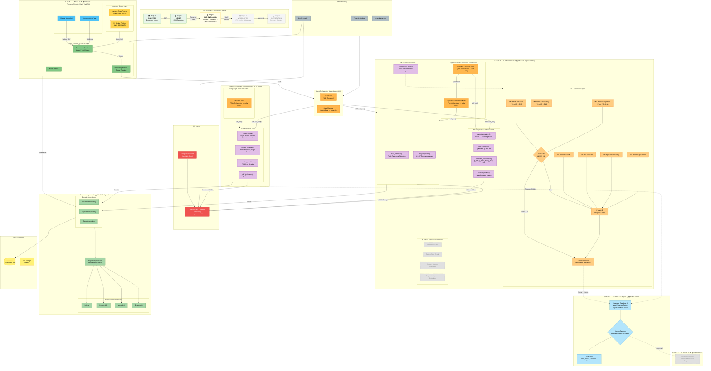

```mermaid
graph TB
    %% ═══════════════════════════════════════════════════
    %% PIPELINE STAGE BANNER
    %% ═══════════════════════════════════════════════════
    subgraph Pipeline["NNP Payment Processing Pipeline"]
        direction LR
        S1["🟢 Stage 1<br><b>INGESTION</b><br>Document Intake"]
        S2["🟢 Stage 2<br><b>KEYER</b><br>Field Extraction"]
        S3["🟡 Stage 3<br><b>AUTHENTICATION</b><br>Signature Validation ✅<br>Other Validations 🔜"]
        S4["⚪ Stage 4<br><b>VERIFICATION</b><br>HITL Review & Approval"]
        S5["⚪ Stage 5<br><b>INTEGRATION</b><br>Payment Dispatch"]
        S1 -->|"PDF"| S2
        S2 -->|"Extracted<br>Data"| S3
        S3 -->|"Auth<br>Result"| S4
        S4 -->|"Approved"| S5
    end

    %% ═══════════════════════════════════════════════════
    %% STAGE 1: INGESTION
    %% ═══════════════════════════════════════════════════
    subgraph Stage1["STAGE 1 — INGESTION 🟢 In Scope"]
        direction TB

        subgraph ExternalSource["Document Source Layer"]
            NetworkFetcher["Network Drive Fetcher<br>(SMB / NFS / CIFS)"]
            S3Fetcher["S3 Bucket Fetcher<br>(AWS S3 / MinIO)"]
        end

        subgraph Frontend["Frontend (React + Vite) - WebSDK"]
            UI["Manual Upload UI"]
            DocList["Document List Page"]
        end

        subgraph APIGateway["API_Gateway_(FastAPI:8000)"]
            DocRouter["Documents Service<br>Upload / List / Status"]
            ProcRouter["Processing Service<br>Trigger Pipeline"]
            HealthCheck["Health / Status"]
        end

        ExternalSource -->|"Auto Fetch"| DocRouter
        UI -->|"Upload PDF"| DocRouter
        DocList -->|"List Docs"| DocRouter
        DocRouter -->|"Trigger"| ProcRouter
    end

    %% ═══════════════════════════════════════════════════
    %% STAGE 2: KEYER (EXTRACTION)
    %% ═══════════════════════════════════════════════════
    subgraph Stage2["STAGE 2 — KEYER (EXTRACTION) 🟢 In Scope"]
        direction TB

        subgraph KeyerNode["LangGraph Node: Extraction"]
            KN["Extraction Node<br>(Thin Orchestrator → calls MCP)"]
        end

        subgraph ExtractionMCP["MCP Extraction Tools"]
            FieldExtract["extract_fields()<br>Payer, Payee, Amount,<br>Date, Account No."]
            MetadataExtract["extract_metadata()<br>PDF Properties, Page Count"]
            ConfidenceScore["extraction_confidence()<br>Field-level Scoring"]
            PDFUtil["pdf_to_images()<br>Page Rasterization"]
        end

        KN -->|"call_tool()"| ExtractionMCP
    end

    %% ═══════════════════════════════════════════════════
    %% STAGE 3: AUTHENTICATION (Signature Only — Phase 1)
    %% ═══════════════════════════════════════════════════
    subgraph Stage3["STAGE 3 — AUTHENTICATION 🟡 Phase 1: Signature Only"]
        direction TB

        subgraph AuthNodes["LangGraph Nodes: Detection + Verification"]
            DN["Signature Detection Node<br>(Thin Orchestrator → calls MCP)"]
            VN["Signature Verification Node<br>(Thin Orchestrator → calls MCP)"]
            DN -->|"AgentState"| VN
        end

        subgraph DetectionMCP["MCP Signature Detection Tools"]
            SigDetect["detect_signatures()<br>Vision → Bounding Boxes"]
            CropSig["crop_signature()<br>PyMuPDF @ 300 DPI"]
            CoordNorm["normalize_coordinates()<br>[x_min,y_min,x_max,y_max] 0-1"]
            SigStore["store_signature()<br>Save Cropped Images"]
        end

        subgraph VerificationMCP["MCP Verification Tools"]
            RefLoad["load_reference()<br>Fetch Reference Signature"]
            M1M7["analyze_metrics()<br>M1-M7 Forensic Analysis"]
            FIVScore["calculate_fiv_score()<br>FIV 1.0 Deterministic Engine"]
        end

        subgraph ScoringEngine["FIV 1.0 Scoring Engine"]
            direction TB
            M1["M1: Stroke Structure<br>⚡ Veto if δ > 0.35"]
            M2["M2: Proportion Ratio"]
            M3["M3: Letter Connectivity<br>⚡ Veto if δ > 0.40"]
            M4["M4: Pen Pressure"]
            M5["M5: Baseline Alignment<br>⚡ Veto if δ > 0.30"]
            M6["M6: Spatial Consistency"]
            M7["M7: Overall Appearance"]
            VetoGate{"Veto Gate<br>M1 | M3 | M5"}
            PenaltyCalc["Penalty Σ<br>Weighted Deltas"]
            FinalScore["Final Confidence<br>max(0, 100 − penalties)"]
            M1 & M3 & M5 --> VetoGate
            VetoGate -->|"Pass"| PenaltyCalc
            VetoGate -->|"Veto → 0"| FinalScore
            M2 & M4 & M6 & M7 --> PenaltyCalc
            PenaltyCalc --> FinalScore
        end

        subgraph FutureAuth["🔜 Future Authentication Checks"]
            AmountValidation["Amount Validation"]
            DateValidation["Date & Stale Check"]
            AccountValidation["Account Number Verification"]
            DuplicateCheck["Duplicate Payment Detection"]
        end

        DN -->|"call_tool()"| DetectionMCP
        VN -->|"call_tool()"| VerificationMCP
        FIVScore -.-> ScoringEngine
    end

    %% ═══════════════════════════════════════════════════
    %% STAGE 4: VERIFICATION (HITL) — Future
    %% ═══════════════════════════════════════════════════
    subgraph Stage4["STAGE 4 — VERIFICATION (HITL) ⚪ Future Phase"]
        direction TB
        ReviewUI["Reviewer Dashboard<br>View Extracted Data +<br>Signature Match Score"]
        ApproveReject{"Human Decision<br>Approve / Reject / Escalate"}
        AuditLog["Audit Trail<br>Who, When, Decision, Reason"]
        ReviewUI --> ApproveReject
        ApproveReject --> AuditLog
    end

    %% ═══════════════════════════════════════════════════
    %% STAGE 5: INTEGRATION — Future
    %% ═══════════════════════════════════════════════════
    subgraph Stage5["STAGE 5 — INTEGRATION ⚪ Future Phase"]
        direction TB
        PaymentGateway["Payment Gateway<br>Dispatch Approved Payments"]
    end

    %% ═══════════════════════════════════════════════════
    %% AGENT ORCHESTRATOR (spans Stages 2-3)
    %% ═══════════════════════════════════════════════════
    subgraph AgentOrchestrator["Agent Orchestrator (LangGraph :8001)"]
        direction LR
        MCPClient["MCP Client<br>(SSE Transport)"]
        StateManager["State Manager<br>(AgentState ↔ Pydantic)"]
    end

    %% ═══════════════════════════════════════════════════
    %% CROSS-CUTTING CONCERNS
    %% ═══════════════════════════════════════════════════
    subgraph LLMLayer["LLM Layer"]
        GeminiAPI["Google Gemini API<br>(gemini-2.5-pro)"]
        RestAdapter["Gemini REST Adapter<br>temp=0.0 | max_tokens=16384"]
        GeminiAPI <--> RestAdapter
    end

    subgraph DBLayer["Database Layer — Pluggable & DB-Agnostic"]
        direction TB
        RepoInterface["Repository Interface<br>(Abstract Base Class)"]
        subgraph Implementations["Swap-in Implementations"]
            SQLiteImpl["SQLite"]
            PostgresImpl["PostgreSQL"]
            MongoImpl["MongoDB"]
            DynamoImpl["DynamoDB"]
        end
        RepoInterface --> SQLiteImpl
        RepoInterface --> PostgresImpl
        RepoInterface --> MongoImpl
        RepoInterface --> DynamoImpl

        subgraph Repositories["Domain Repositories"]
            DocRepo["DocumentRepository"]
            SigRepo["SignatureRepository"]
            ResultRepo["ResultRepository"]
        end
        Repositories --> RepoInterface
    end

    subgraph DataStores["Physical Storage"]
        AnyDB[("Configured DB")]
        FileStore["File Storage<br>/data/*"]
    end

    subgraph SharedLib["Shared Library"]
        Schemas["Pydantic Models"]
        ConfigLoader["Config Loader"]
        LLMAbstraction["LLM Abstraction"]
    end

    %% ═══════════════════════════════════════════════════
    %% DATA FLOW CONNECTIONS
    %% ═══════════════════════════════════════════════════

    %% Stage 1 → Agent
    ProcRouter -->|"HTTP"| AgentOrchestrator

    %% Agent → MCP (Stages 2 & 3)
    AgentOrchestrator -->|"SSE call_tool()"| ExtractionMCP
    AgentOrchestrator -->|"SSE call_tool()"| DetectionMCP
    AgentOrchestrator -->|"SSE call_tool()"| VerificationMCP

    %% MCP → LLM
    ExtractionMCP -->|"Structured JSON"| RestAdapter
    DetectionMCP -->|"Vision + BBox"| RestAdapter
    VerificationMCP -->|"M1-M7 Prompt"| RestAdapter

    %% Stage 3 → Stage 4 (future)
    FinalScore -.->|"Score + Report"| ReviewUI
    Stage2 -.->|"Extracted Fields"| ReviewUI

    %% Stage 4 → Stage 5 (future)
    ApproveReject -.->|"Approved"| PaymentGateway

    %% DB connections
    APIGateway -->|"Read/Write"| Repositories
    ExtractionMCP -->|"Persist"| Repositories
    VerificationMCP -->|"Persist"| Repositories
    Repositories --> AnyDB

    %% Shared
    ConfigLoader --> APIGateway
    ConfigLoader --> RestAdapter
    SharedLib --> AgentOrchestrator

    %% ═══════════════════════════════════════════════════
    %% STYLING
    %% ═══════════════════════════════════════════════════
    classDef stageActive fill:#C8E6C9,stroke:#2E7D32,color:#000,stroke-width:2px
    classDef stagePartial fill:#FFF9C4,stroke:#F9A825,color:#000,stroke-width:2px
    classDef stageFuture fill:#E0E0E0,stroke:#9E9E9E,color:#666,stroke-dasharray: 5 5
    classDef pipelineNode fill:#E8F5E9,stroke:#4CAF50,color:#000
    classDef pipelinePartial fill:#FFFDE7,stroke:#FFC107,color:#000
    classDef pipelineFuture fill:#F5F5F5,stroke:#BDBDBD,color:#999
    classDef frontend fill:#4FC3F7,stroke:#0288D1,color:#000
    classDef api fill:#81C784,stroke:#388E3C,color:#000
    classDef agent fill:#FFB74D,stroke:#F57C00,color:#000
    classDef mcptool fill:#E1BEE7,stroke:#7B1FA2,color:#000
    classDef llm fill:#EF5350,stroke:#C62828,color:#fff
    classDef shared fill:#B0BEC5,stroke:#455A64,color:#000
    classDef db fill:#A5D6A7,stroke:#2E7D32,color:#000
    classDef data fill:#FFF176,stroke:#F9A825,color:#000
    classDef scoring fill:#FFCC80,stroke:#EF6C00,color:#000
    classDef external fill:#FFD54F,stroke:#FF8F00,color:#000
    classDef future fill:#E0E0E0,stroke:#9E9E9E,color:#888,stroke-dasharray: 5 5
    classDef hitl fill:#B3E5FC,stroke:#0277BD,color:#000

    class S1,S2 pipelineNode
    class S3 pipelinePartial
    class S4,S5 pipelineFuture
    class UI,DocList frontend
    class DocRouter,ProcRouter,HealthCheck api
    class MCPClient,StateManager,KN,DN,VN agent
    class FieldExtract,MetadataExtract,ConfidenceScore,PDFUtil,SigDetect,CropSig,CoordNorm,SigStore,RefLoad,M1M7,FIVScore mcptool
    class GeminiAPI,RestAdapter llm
    class Schemas,ConfigLoader,LLMAbstraction shared
    class RepoInterface,SQLiteImpl,PostgresImpl,MongoImpl,DynamoImpl,DocRepo,SigRepo,ResultRepo db
    class AnyDB,FileStore data
    class M1,M2,M3,M4,M5,M6,M7,VetoGate,PenaltyCalc,FinalScore scoring
    class NetworkFetcher,S3Fetcher external
    class AmountValidation,DateValidation,AccountValidation,DuplicateCheck future
    class ReviewUI,ApproveReject,AuditLog hitl
    class PaymentGateway,Notification,Reconciliation future
```