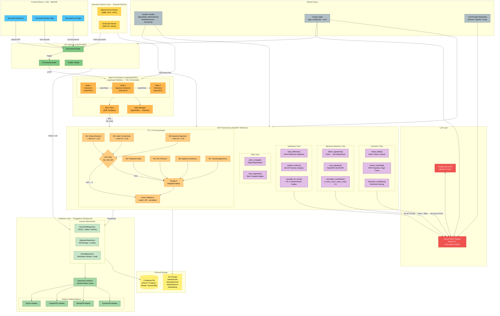

```mermaid
graph TB
    subgraph Frontend["Frontend (React + Vite) - WebSDK"]
        UI["Document Upload UI"]
        Review["Document Review Page"]
        DocList["Document List Page"]
    end

    subgraph APIGateway["API Gateway (FastAPI:8000)"]
        DocRouter["Documents Router"]
        ProcRouter["Processing Router"]
        HealthCheck["Health / Status"]
    end

    subgraph AgentOrchestrator["Agent Orchestrator (LangGraph:8001)"]
        direction TB
        subgraph Workflow["LangGraph Workflow — Thin Orchestration"]
            direction LR
            N1["Node 1<br>Extraction<br>(calls MCP)"]
            N2["Node 2<br>Signature Detection<br>(calls MCP)"]
            N3["Node 3<br>Verification<br>(calls MCP)"]
            N1 -->|"AgentState"| N2
            N2 -->|"AgentState"| N3
        end
        MCPClient["MCP Client<br>(SSE Transport)"]
        StateManager["State Manager<br>(AgentState ↔ Pydantic)"]
        Workflow --> MCPClient
        Workflow --> StateManager
    end

    subgraph MCPLayer["MCP Tools Server (FastMCP :8002/sse)"]
        direction TB

        subgraph ExtractionTools["Extraction Tools"]
            FieldExtract["extract_fields()<br>Payer, Payee, Amount"]
            MetadataExtract["extract_metadata()<br>PDF Properties, Page Count"]
            ConfidenceScore["extraction_confidence()<br>Field-level Scoring"]
        end

        subgraph DetectionTools["Signature Detection Tools"]
            SigDetect["detect_signatures()<br>Vision → Bounding Boxes"]
            CropSig["crop_signature()<br>PyMuPDF @ 300 DPI"]
            CoordNorm["normalize_coordinates()<br>[x_min,y_min,x_max,y_max] 0-1"]
        end

        subgraph VerificationTools["Verification Tools"]
            RefLoad["load_reference()<br>Fetch Reference Signature"]
            M1M7["analyze_metrics()<br>M1-M7 Forensic Analysis"]
            FIVScore["calculate_fiv_score()<br>FIV 1.0 Deterministic Engine"]
        end

        subgraph UtilityTools["Utility Tools"]
            PDFUtil["pdf_to_images()<br>Page Rasterization"]
            SigStore["store_signature()<br>Save Cropped Images"]
        end

        subgraph ScoringEngine["FIV 1.0 Scoring Engine"]
            direction TB
            M1["M1: Stroke Structure<br>⚡ Veto if δ > 0.35"]
            M2["M2: Proportion Ratio"]
            M3["M3: Letter Connectivity<br>⚡ Veto if δ > 0.40"]
            M4["M4: Pen Pressure"]
            M5["M5: Baseline Alignment<br>⚡ Veto if δ > 0.30"]
            M6["M6: Spatial Consistency"]
            M7["M7: Overall Appearance"]
            VetoGate{"Veto Gate<br>M1 | M3 | M5"}
            PenaltyCalc["Penalty Σ<br>Weighted Deltas"]
            FinalScore["Final Confidence<br>max(0, 100 − penalties)"]
            M1 & M3 & M5 --> VetoGate
            VetoGate -->|"Pass"| PenaltyCalc
            VetoGate -->|"Veto → 0"| FinalScore
            M2 & M4 & M6 & M7 --> PenaltyCalc
            PenaltyCalc --> FinalScore
        end
    end

    subgraph LLMLayer["LLM Layer"]
        GeminiAPI["Google Gemini API<br>(gemini-2.5-pro)"]
        RestAdapter["Gemini REST Adapter<br>temp=0.0 | max_tokens=16384"]
        GeminiAPI <--> RestAdapter
    end

    subgraph DBLayer["Database Layer — Pluggable & DB-Agnostic"]
        direction TB
        RepoInterface["Repository Interface<br>(Abstract Base Class)"]
        subgraph Implementations["Swap-in Implementations"]
            SQLiteImpl["SQLite Adapter"]
            PostgresImpl["PostgreSQL Adapter"]
            MongoImpl["MongoDB Adapter"]
            DynamoImpl["DynamoDB Adapter"]
        end
        RepoInterface --> SQLiteImpl
        RepoInterface --> PostgresImpl
        RepoInterface --> MongoImpl
        RepoInterface --> DynamoImpl

        subgraph Repositories["Domain Repositories"]
            DocRepo["DocumentRepository<br>CRUD + Status Tracking"]
            SigRepo["SignatureRepository<br>Ref Storage + Lookup"]
            ResultRepo["ResultRepository<br>Verification Results + Audit"]
        end

        Repositories --> RepoInterface
    end

    subgraph DataStores["Physical Storage"]
        AnyDB[("Configured DB<br>(SQLite / Postgres /<br>Mongo / DynamoDB)")]
        FileStore["File Storage<br>/data/uploads<br>/data/signatures<br>/data/reference<br>/data/debug"]
    end

    subgraph ExternalSource["Document Source Layer — External Fetchers"]
        NetworkFetcher["Network Drive Fetcher<br>(SMB / NFS / CIFS)"]
        S3Fetcher["S3 Bucket Fetcher<br>(AWS S3 / MinIO)"]
    end

    subgraph SharedLib["Shared Library"]
        Schemas["Pydantic Models<br>(AgentState, MetricsResult,<br>SimilarityFactors, Document)"]
        ConfigLoader["Config Loader<br>(app_config.yaml + .env)"]
        LLMAbstraction["LLM Provider Abstraction<br>(Gemini / OpenAI / Local)"]
    end

    %% Frontend → API
    UI -->|"Upload PDF"| DocRouter
    Review -->|"View Results"| DocRouter
    DocList -->|"List Documents"| DocRouter
    DocRouter -->|"Trigger"| ProcRouter
    ProcRouter -->|"HTTP"| Workflow

    %% External Source → API / MCP
    ExternalSource -->|"Fetch Document"| DocRouter
    ExternalSource -->|"Fetch Raw Files"| MCPLayer

    %% Agent → MCP
    MCPClient -->|"SSE<br>call_tool()"| MCPLayer

    %% MCP → LLM
    ExtractionTools -->|"Structured JSON"| RestAdapter
    DetectionTools -->|"Vision + BBox"| RestAdapter
    VerificationTools -->|"M1-M7 Prompt"| RestAdapter

    %% MCP → DB
    MCPLayer -->|"Read/Write"| Repositories

    %% API → DB (status queries)
    APIGateway -->|"Status / List"| Repositories

    %% DB → Storage
    Repositories --> AnyDB
    MCPLayer --> FileStore

    %% Shared
    Schemas --> Workflow
    Schemas --> MCPLayer
    ConfigLoader --> APIGateway
    ConfigLoader --> MCPLayer
    ConfigLoader --> RestAdapter
    LLMAbstraction --> RestAdapter

    classDef frontend fill:#4FC3F7,stroke:#0288D1,color:#000
    classDef api fill:#81C784,stroke:#388E3C,color:#000
    classDef agent fill:#FFB74D,stroke:#F57C00,color:#000
    classDef mcp fill:#CE93D8,stroke:#7B1FA2,color:#000
    classDef mcptool fill:#E1BEE7,stroke:#7B1FA2,color:#000
    classDef llm fill:#EF5350,stroke:#C62828,color:#fff
    classDef shared fill:#B0BEC5,stroke:#455A64,color:#000
    classDef db fill:#A5D6A7,stroke:#2E7D32,color:#000
    classDef dbrepo fill:#C8E6C9,stroke:#2E7D32,color:#000
    classDef data fill:#FFF176,stroke:#F9A825,color:#000
    classDef scoring fill:#FFCC80,stroke:#EF6C00,color:#000
    classDef external fill:#FFD54F,stroke:#FF8F00,color:#000

    class UI,Review,DocList frontend
    class DocRouter,ProcRouter,HealthCheck api
    class N1,N2,N3,MCPClient,StateManager agent
    class FieldExtract,MetadataExtract,ConfidenceScore,SigDetect,CropSig,CoordNorm,RefLoad,M1M7,FIVScore,PDFUtil,SigStore mcptool
    class GeminiAPI,RestAdapter llm
    class Schemas,ConfigLoader,LLMAbstraction shared
    class RepoInterface,SQLiteImpl,PostgresImpl,MongoImpl,DynamoImpl db
    class DocRepo,SigRepo,ResultRepo dbrepo
    class AnyDB,FileStore data
    class M1,M2,M3,M4,M5,M6,M7,VetoGate,PenaltyCalc,FinalScore scoring
    class NetworkFetcher,S3Fetcher external
```